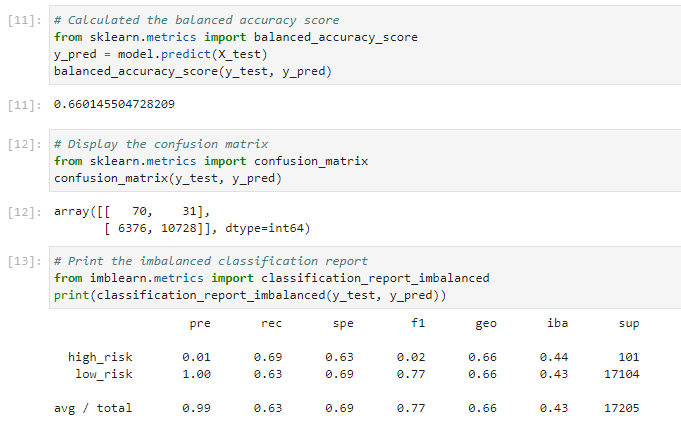
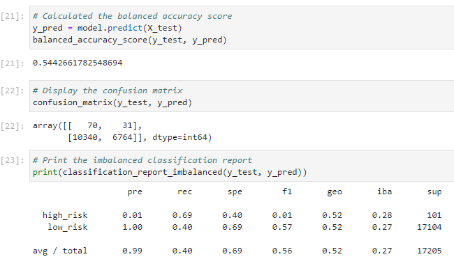
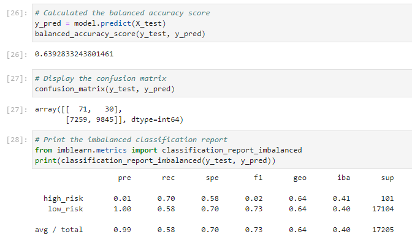
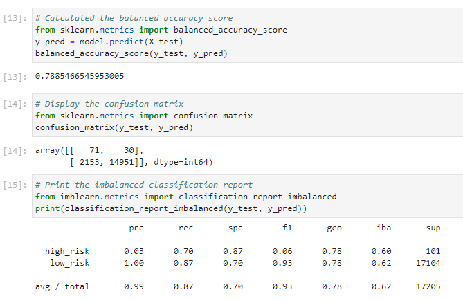
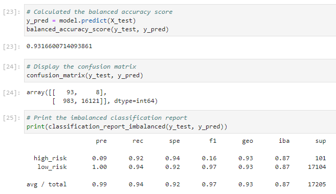

# Credit_Risk_Analysis
Employing supervised machine learning to evaluate credit card risk and credit assessment from an established lending dataset.

# Purpose

Credit risk is an inherently unbalanced classification problem, as good loans easily outnumber risky loans. Therefore, there is a need to employ different techniques to train and evaluate models with unbalanced classes. This code uses the `imbalanced-learn` and `scikit-learn` libraries to build and evaluate models using resampling.

Using the credit card credit dataset from LendingClub, a peer-to-peer lending services company, we oversample the data using the `RandomOverSampler` and `SMOTE` algorithms, and undersample the data using the `ClusterCentroids` algorithm. Then, we use a combinatorial approach of over- and undersampling using the `SMOTEENN` algorithm. Next, we compare two new machine learning models that reduce bias, `BalancedRandomForestClassifier` and `EasyEnsembleClassifier`, to predict credit risk. These methods will help evaluate the performance of these models so that a recommendation on whether they can be used to predict credit risk can be made.

# Results

- Oversample / RandomOverSampler
    - 

    - Balanced accuracy scores = 0.66
    - High_risk Precision = 0.01
    - High_risk recall (Sensitivity) = 0.69
    - High_risk F1 score = 0.02
    - Low_risk Precision = 1.0
    - Low_risk recall = 0.63
    - Low_risk F1 score = 0.77
    - The high_risk precision score doesn't looks good and this make the f1 score result in worse

    
- Oversample / SMOTE
    - 

    - Balanced accuracy scores = 0.662
    - High_risk Precision = 0.01
    - High_risk recall (Sensitivity) = 0.63
    - High_risk F1 score = 0.02
    - Low_risk Precision = 1.0
    - Low_risk recall = 0.69
    - Low_risk F1 score = 0.82
    - The high_risk precision score doesn't looks good and this make the f1 score result in worse

- Undersample / ClusterCentroids
    - 

    - Balanced accuracy scores = 0.544
    - High_risk Precision = 0.01
    - High_risk recall (Sensitivity) = 0.69
    - High_risk F1 score = 0.01
    - Low_risk Precision = 1.0
    - Low_risk recall = 0.40
    - Low_risk F1 score = 0.56
    - Undersampleing with ClusterCentroids reports are even worse than the oversample models above. 

- Combine (Over- and Undersample) / SMOTEENN algorithm
    - 

    - Balanced accuracy scores = 0.64
    - High_risk Precision = 0.01
    - High_risk recall (Sensitivity) = 0.70
    - High_risk F1 score = 0.02
    - Low_risk Precision = 1.0
    - Low_risk recall = 0.58
    - Low_risk F1 score = 0.73
    - We don't see much improvement using resampling with SMOTEENN, only some of the metrics such as recall score has an improvement over undersampling.

- BalanceRandomForestClassifier
    - 

    - Balanced accuracy scores = 0.788
    - High_risk Precision = 0.03
    - High_risk recall (Sensitivity) = 0.70
    - High_risk F1 score = 0.06
    - Low_risk Precision = 1.0
    - Low_risk recall = 0.87
    - Low_risk F1 score = 0.93
    - Using ensemble algorithms with Balance Random forest Classifier is impressive, we have a great balanced accuracy score, all the metrics on classification report looks great.

- EasyEnsebleClassifier
    - 

    - Balanced accuracy scores = 1.0
    - High_risk Precision = 0.92
    - High_risk recall (Sensitivity) = 0.94
    - High_Risk_F1 score = 0.16
    - Low_Risk_F1 score = 0.97
    - Low_risk Precision = 1.0
    - Low_risk recall = 0.94
    - Low_risk F1 score = 0.92
    - Using ensemble algorithms with Easy Enseble Classifier is impressive, we have a great balanced accuracy score, all the metrics on classification report are score in high 90's.

# Summary

According to the balanced accuracy scores, and the metric scores from classification reports of each models, the Easy Enseble Classifier has the best balance, Balance Random Forest Classifier in second place. I would recommend both ensemble model.